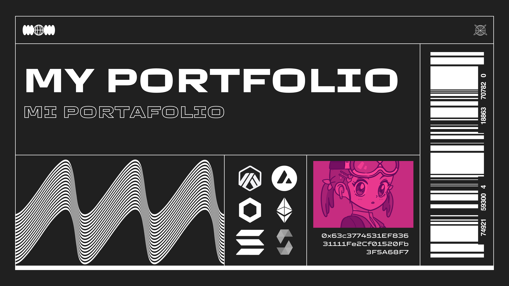

# My portfolio

**Language:** [English](#english) | [Español](#espanol)

Welcome! In this repository, you will find a selection of exciting projects related to blockchain development, web3, and smart contracts.

## Featured Projects

### Lottery Project

Lottery is a lottery system written in Solidity, which utilizes blockchain technology for its operation. The highlight of this project is the incorporation of [Chainlink VRF](https://docs.chain.link/docs/chainlink-vrf/) to generate random numbers, ensuring transparency and fairness in the process. Additionally, we have implemented [Chainlink Automation](https://docs.chain.link/chainlink-automation/introduction) to program the automation of the raffle, making the entire process reliable and secure.

[Repo page](https://github.com/jistro/my-portafolio/tree/main/NogglesNFT)

### Noggles NFT Project

Inspired by the NFT/DAO project [nouns](https://nouns.wtf/), Noggles NFT is a collection of unique lenses stored entirely on the blockchain. Users have the exciting ability to change the color of these lenses. Behind the scenes, users simply modify the metadata associated with the token, giving them the freedom to customize their experience and showcase their style.

[Repo page](https://github.com/jistro/my-portafolio/tree/main/lottery)

### gm Fam!

An easy-to-use dApp lets any NFT holder or community group (called a SAFE) set up a wrapped NFT Smart Contract. This is for community members who want a new direction. Features include choosing new fees for creators, making a list of addresses or tokenIDs that can join, setting a new price for MINT, and choosing metadata. 

[Repo page](https://github.com/ariutokintumi/gm-fam)

### Arbitrum Gas Hub

Gas hub is a vital tool tailored for Arbitrum users. It helps users access real-time data on gas prices and transaction fees, enabling them to make more cost-effective and informed decisions when using the Arbitrum network. This tool streamlines the process of finding essential information, simplifying the user experience on Arbitrum.

[Repo page](https://github.com/jistro/GasStation_Arbitrum)

[page](https://gas-hub.vercel.app/)

### ICPoaps

ICPoap is a protocol on the Internet Computer storing data for POAP. It enables common use of POAP and on-chain certificates for courses or events, whether in-person or virtual. Users can secure their digital attendance badges on the decentralized Internet Computer, ensuring information security and immutability. It also issues certificates for course completion, fostering connections among participants.

[Repo page](https://github.com/jistro/ICPoaps)

---

# Portafolio

**Idioma:** [English](#english) | [Español](#espanol)

¡Bienvenido! En este repositorio, encontrarás una selección de emocionantes proyectos relacionados con el desarrollo blockchain, web3 y smart contracts.

## Proyectos Destacados

### Proyecto Lottery

Lottery es un sistema de lotería escrito en Solidity, el cual utiliza la tecnología de blockchain para su funcionamiento. Lo más destacado de este proyecto es la incorporación de [Chainlink VRF](https://docs.chain.link/docs/chainlink-vrf/) para generar números aleatorios, asegurando la transparencia y la imparcialidad del proceso. Además, hemos implementado [Chainlink Automation](https://docs.chain.link/chainlink-automation/introduction) para programar la automatización de la rifa, haciendo que todo el proceso sea confiable y seguro.

[Repositorio](https://github.com/jistro/my-portafolio/tree/main/lottery)

### Proyecto Noggles NFT

Inspirado en el proyecto de NFT/DAO [nouns](https://nouns.wtf/), Noggles NFT es una colección de lentes únicos almacenados completamente en la cadena de bloques. Los usuarios tienen la emocionante capacidad de cambiar el color de estos lentes. Detrás de escena, los usuarios simplemente modifican los metadatos asociados al token, lo que les brinda la libertad de personalizar su experiencia y exhibir su estilo.

[Repositorio](https://github.com/jistro/my-portafolio/tree/main/NogglesNFT)

## gm Fam!

Una dApp fácil de usar permite a cualquier titular de NFT o grupo comunitario (llamado SAFE) configurar un contrato inteligente NFT envuelto. Esto es para miembros de la comunidad que quieren una nueva dirección. Las características incluyen elegir nuevas tarifas para los creadores, hacer una lista de direcciones o tokenID que pueden unirse, establecer un nuevo precio para MINT y elegir metadatos.

[Repositorio](https://github.com/ariutokintumi/gm-fam)

### Arbitrum Gas Hub

Gas hub es una herramienta vital diseñada para los usuarios de Arbitrum. Ayuda a los usuarios a acceder a datos en tiempo real sobre los precios del gas y las tarifas de transacción, lo que les permite tomar decisiones más rentables e informadas al utilizar la red Arbitrum. Esta herramienta agiliza el proceso de búsqueda de información esencial, simplificando la experiencia del usuario en Arbitrum.

[Repositorio](https://github.com/jistro/GasStation_Arbitrum)

[Pagina web](https://gas-hub.vercel.app/)

### ICPoaps

ICPoap es un protocolo en Internet Computer que almacena datos para POAP. Permite el uso común de POAP y certificados en cadena para cursos o eventos, ya sean presenciales o virtuales. Los usuarios pueden asegurar sus distintivos digitales de asistencia en el Internet Computer descentralizado, garantizando la seguridad de la información y su inmutabilidad. También emite certificados para la finalización de cursos, fomentando conexiones entre los participantes.

[Repositorio](https://github.com/jistro/ICPoaps)

---
